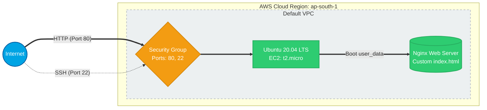
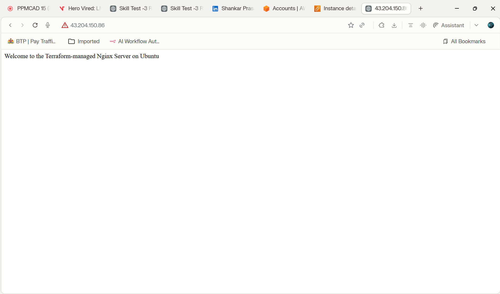

# Terraform Nginx Deployment Assignment

This repository contains the Terraform configuration for deploying an Nginx web server on an AWS EC2 instance running Ubuntu 20.04 LTS.

## Infrastructure Overview



## Resources Created

1. **AWS Provider**: Configured for `ap-south-1`.
2. **EC2 Instance**: `t2.micro` running Ubuntu 20.04 LTS.
3. **Security Group**: Allows inbound traffic on ports `80` (HTTP) and `22` (SSH), and all outbound traffic.
4. **User Data Script**: Automatically installs Nginx and configures a custom `index.html` page using the following commands during instance boot:
   ```bash
   #!/bin/bash
   apt-get update
   apt-get install -y nginx
   echo "Welcome to the Terraform-managed Nginx Server on Ubuntu" > /var/www/html/index.html
   systemctl start nginx
   systemctl enable nginx
   ```

## Prerequisites

- Terraform CLI installed.
- AWS CLI configured with valid credentials (`aws configure`).

## Run Instructions

1. **Initialize Terraform**:
   ```bash
   terraform init
   ```
2. **Review the Deployment Plan**:
   ```bash
   terraform plan
   ```
3. **Apply the Configuration**:
   ```bash
   terraform apply
   ```
   Type `yes` when prompted. Wait for the `instance_public_ip` to be outputted.
4. **Verify Deployment**:
   Open a browser and navigate to the public IP address displayed in the outputs. You should see:
   `Welcome to the Terraform-managed Nginx Server on Ubuntu`

## Verification Screenshots



## Cleanup

To avoid incurring charges, destroy the infrastructure after verification:
```bash
terraform destroy
```
